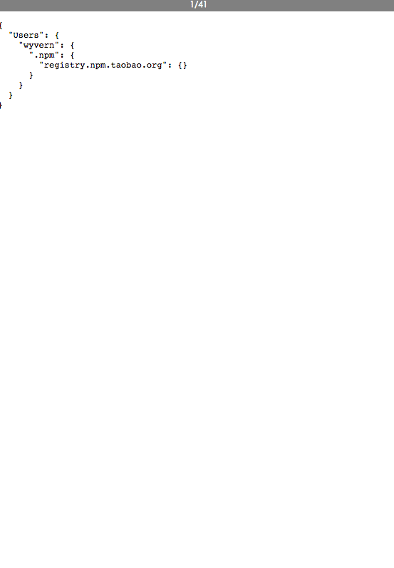

# fs-animation
[](https://travis-ci.org/wyvernnot/fs-animation)
[](https://www.npmjs.com/package/fs-animation)
[](https://coveralls.io/github/wyvernnot/fs-animation)
[](http://npm-stat.com/charts.html?package=fs-animation)
[](https://github.com/wyvernnot/fs-animation/blob/master/LICENSE)
[](https://hub.docker.com/r/wyvernnot/fs-animation/)

Realtime file system change animation which can also be played back. Built on [Immutable.JS](https://github.com/facebook/immutable-js/)

## Installation

```sh
npm install fs-animation -g
```

## Usage 

Watch current folder:

```sh
fs-animation
```

Watch multiple folders:

```sh
fs-animation /tmp/a /tmp/b
```

## Options

```sh
fs-animation -h
```

Options           |     Default     |     Description
------------------|-----------------|------------------
hostname          | 127.0.0.1       | Listening hostname
ignoreInitial     | true            | Existing files will not trigger evnets
ignoredDotFiles   | true            | Ignore file folds starts with dot, eg: .git
ignore            | null            | Directories to ignore
port              | 8001            | Listening port
throttle          | 100             | throttle of broadcasting

## Logging

Default loggin level is `warn`，you can overide it using `-v` options.

Option    | LogLevel     
----------|-------------
-v        | Info      
-vv       | Debug         
-vvv      | Trace         

## Testing

```sh
npm test
```

## Docker usage

```sh
sudo docker run -P -v=/tmp:/watched:ro wyvernnot/fs-animation 
```

## Example 1 - NPM install progress behind scenes

```sh
fs-animation --ignoredDotFiles false ~/.npm /tmp -v
```

```sh
cd /tmp
npm install debug
```



## Example 2 - Watch docker directory


## License

MIT

